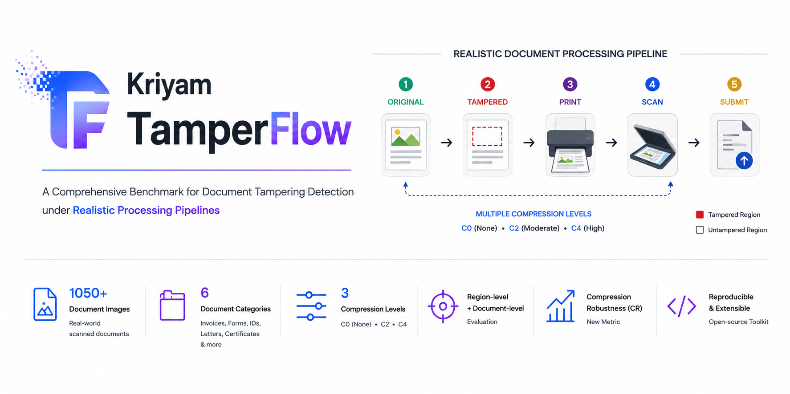

# Kriyam TamperFlow

<p align="center">
  
</p>

<p align="center">
  <a href="https://arxiv.org/abs/XXXX.XXXXX"></a>
  <a href="https://huggingface.co/datasets/kriyam-ai/kriyam-tamperflow"></a>
  <a href="LEADERBOARD.md"></a>
  <a href="LICENSE"></a>
  <a href="https://doi.org/10.5281/zenodo.21469088"></a>
</p>

---

## What is this?

**Kriyam TamperFlow** is the first benchmark for evaluating document tampering detection models on Indian documents. It accompanies the research paper:

> *"Kriyam TamperFlow: Benchmarking Document
Tampering Detection under Realistic Document
Processing Pipelines"*
> [Avishek Jana, Swati Kumari] — [2026]

### The problem

State-of-the-art document forgery detection models — CAFTB, DTD, ADCD-Net, CAT-Net, FFDN, TIFDM, MVSS-Net — rely heavily on **JPEG compression artifact fingerprints**: inconsistencies in DCT coefficients, block artifact grids, and noise patterns left behind by image editing. These signals work well on pristine photographic images.

In the real world, documents are scanned, photocopied, emailed, and re-saved repeatedly. Each JPEG re-compression pass **erases the very forensic signals these models depend on**. A model that achieves 90% AUC on a standard benchmark can collapse to near-random performance on a scanned Aadhaar card or a faxed invoice.

Kriyam makes this failure mode quantitatively visible for the first time, specifically on **Indian documents** — a domain entirely absent from existing benchmarks.

### What makes this benchmark different

| Property | Existing benchmarks | Kriyam |
|---|---|---|
| Document domain | Western / generic images | Medical, financial, invoices, educational, administrative docs |
| Compression stress-test | None | Three tiers: pristine → real-world → photocopy |
| Ground truth | Document-level or pixel masks | Per-region bounding boxes, multiple tamper types per region |
| Evaluation | Single metric | Region-F1, Doc-AUC, FPR, Compression Robustness |
| AI-generated forgeries | Not addressed | Out of scope for v1.0 — a different forensic problem |

---

## Dataset

The dataset contains **1,050 documents** (700 tampered, 350 authentic) across multiple Indian document categories. Each source image is provided at **three compression tiers** — giving **3,150 image files** total — with **1,050 annotation files** shared across tiers.

### Tampering types

| Type | Code | Description |
|---|---|---|
| Copy-Move | `copy_move` | Region duplicated within the same document |
| Splicing | `splice` | Content inserted from an external source |
| Text Replacement | `text_replace` | Names, numbers, or amounts altered |
| Inpainting | `inpaint` | Region erased and filled |

A single region can carry **multiple tamper types simultaneously** (e.g. a region that was copy-moved and then inpainted to conceal the boundary).

### Compression tiers

| Tier | Code | Description |
|---|---|---|
| Pristine | `C0` | No re-compression. Lossless PNG. Full forensic signal. |
| Double-pass | `C2` | Two JPEG saves (Q=85 → Q=80). Simulates export and email. |
| Photocopy-sim | `C4` | Scan simulation + blur + noise + JPEG Q=70. Hardest condition. |

### Download the dataset

```bash
python scripts/download_data.py
```

This fetches all 3,150 images across three compression tiers from HuggingFace into `data/images/`. Images and annotations are never stored in this git repository.

---

## Evaluate your model

You do not need to modify this codebase or implement any interface. Run your model however you like, produce prediction JSON files, and run the evaluator.

### Step 1 — Clone and install

```bash
git clone https://github.com/Kriyam-ai/kriyam-tamperflow
cd kriyam-tamperflow
pip install -e ".[dev]"
```

### Step 2 — Download the dataset

```bash
python scripts/download_data.py
```

This fetches all **3,150 images** across the three compression tiers (C0, C2, C4) into `data/images/`.

```
data/images/
├── kriyam_0001_C0.png        ← pristine (no re-compression)
├── kriyam_0001_C2.png        ← double JPEG pass (Q=85 → Q=80)
├── kriyam_0001_C4.png        ← photocopy simulation + noise + Q=70
└── ...                       ← 1,050 documents × 3 tiers = 3,150 files
```

### Step 3 — Run your model on the benchmark images

Your model reads images from `data/images/` and produces **one prediction JSON per image file**. Images are named:

```
kriyam_{index:04d}_{tier}.png
```

Examples: `kriyam_0001_C0.png`, `kriyam_0001_C2.png`, `kriyam_0001_C4.png`

Authentic and tampered images are mixed in the same folder. The filename reveals nothing about authenticity — that is for your model to determine.

Each source document has three image files (one per compression tier), and your model must produce a **separate prediction JSON for each**:

| Image file | → | Prediction file |
|------------|---|-----------------|
| `data/images/kriyam_0042_C0.png` | → | `predictions/<model>/kriyam_0042_C0.json` |
| `data/images/kriyam_0042_C2.png` | → | `predictions/<model>/kriyam_0042_C2.json` |
| `data/images/kriyam_0042_C4.png` | → | `predictions/<model>/kriyam_0042_C4.json` |

### Step 4 — Create your prediction folder

```
predictions/
└── your_model_name/
    ├── kriyam_0042_C0.json
    ├── kriyam_0042_C2.json
    ├── kriyam_0042_C4.json
    └── ...
```

Each prediction file follows this format:

```json
{
  "id": "kriyam_0042_C0",
  "model": "your_model_name",
  "regions": [
    { "x": 138, "y": 85, "w": 220, "h": 50, "confidence": 0.94 },
    { "x": 55,  "y": 178, "w": 318, "h": 32, "confidence": 0.76 }
  ]
}
```

**Field rules:**
- `regions` (list) — predicted tampered bounding boxes. **This is the only required output field.** Leave as `[]` if your model predicts the document is authentic or produces no localisations.
- Each region requires `x`, `y`, `w`, `h` (pixels, matching the original image coordinate space) and `confidence` (float 0–1).
- The evaluator derives the document-level prediction automatically: `pred_confidence = max(region confidences)` if any regions exist, else `0.0`. A fixed threshold (default `0.5`, overridable via `--document-threshold`) converts this to a binary `pred_label` for Doc-F1 and FPR. Doc-AUC uses the continuous `pred_confidence` directly (threshold-free).
- If your model outputs a heatmap, convert to bounding boxes using connected components before submitting.

### Step 5 — Validate your predictions

Before running evaluation, check your submission for errors:

```bash
python scripts/validate_predictions.py \
  --predictions predictions/your_model_name/
```

This checks that all required files are present, JSON is valid, coordinates are within image bounds, and confidence values are in range. Annotations are downloaded automatically on first run (same as Step 6). Fix any issues it reports before proceeding.

### Step 6 — Run the evaluator

```bash
python scripts/evaluate.py \
  --predictions predictions/your_model_name/ \
  --report-out reports/your_model_full.html
```

Every run automatically writes two files to `results/your_model_name/`:

| File | Contents |
|---|---|
| `scores.json` | Aggregated metrics per tier (with the threshold baked in) |
| `raw_results.jsonl` | Per-image results — used to re-generate reports at a new threshold without re-running the full evaluation (see Step 6b) |

#### Common options

**Set the document confidence threshold**

The evaluator converts each image's `max(region confidence)` into a binary prediction using a fixed threshold (default `0.5`). Doc-F1 and FPR both depend on this threshold; Doc-AUC is always threshold-free. Use the same value across all models so results are directly comparable.

```bash
python scripts/evaluate.py \
  --predictions predictions/your_model_name/ \
  --document-threshold 0.3 \
  --report-out reports/your_model_t030.html
```

**Set the region IoU threshold**

Predicted regions are matched to ground-truth regions using the Hungarian algorithm. A matched pair counts as a true positive only if their IoU meets the threshold (default `0.1`, per the benchmark spec). Raising this demands tighter localisation; lowering it is more lenient.

```bash
python scripts/evaluate.py \
  --predictions predictions/your_model_name/ \
  --iou-threshold 0.3 \
  --report-out reports/your_model_iou03.html
```

> **Note:** Changing the IoU threshold affects region matching and requires a full re-evaluation. It cannot be applied from cached raw results (see Step 6b).

**Speed up with multiple cores**

The evaluator scores samples in parallel using threads (default: 2 workers). Set `--workers` to the number of CPU cores you want to use:

```bash
python scripts/evaluate.py \
  --predictions predictions/your_model_name/ \
  --workers 8 \
  --report-out reports/your_model_full.html
```

**Choose the report template**

Three HTML report layouts are available:

| Template | Flag | Description |
|---|---|---|
| `v1` | `--report-template v1` | Default. Card-based layout with per-tier tables and degradation charts. |
| `v2` | `--report-template v2` | Research-report style. Full-width stacked charts. |
| `v3` | `--report-template v3` | Academic paper style — serif type, booktabs tables, figure captions. |

```bash
python scripts/evaluate.py \
  --predictions predictions/your_model_name/ \
  --report-template v3 \
  --report-out reports/your_model_v3.html
```

#### All CLI options

| Option | Default | Description |
|---|---|---|
| `--predictions DIR` | *(required)* | Path to the model's prediction folder |
| `--data-dir DIR` | `./data` | Root of the benchmark data directory |
| `--tiers C0 C2 C4` | all three | Compression tiers to evaluate |
| `--report-out PATH` | `reports/report.html` | Output path for the HTML report |
| `--workers N` | `2` | Number of parallel worker threads for scoring |
| `--document-threshold FLOAT` | `0.5` | Confidence threshold for binary `pred_label` (Doc-F1, FPR) |
| `--iou-threshold FLOAT` | `0.1` | Minimum IoU for a region pair to count as a true positive |
| `--report-template v1\|v2\|v3` | `v1` | Report layout |
| `--verbose` | off | Enable debug logging |

### Step 6b — Re-generate a report at a different threshold (fast)

Changing `--document-threshold` re-affects only Doc-F1 and FPR. Rather than re-running the full 15–20 min evaluation, use the cached raw results:

```bash
python scripts/report_from_cache.py \
  --results results/your_model_name/ \
  --document-threshold 0.3 \
  --report-out reports/your_model_t030.html
```

This reads `results/your_model_name/raw_results.jsonl`, re-applies the new threshold, and writes a new report in seconds. Add `--report-template v3` for the academic paper layout.

> **Note:** `report_from_cache.py` only works for `--document-threshold`. Changing `--iou-threshold` requires a full re-run with `evaluate.py`.

### Step 7 — View the report

Open the generated HTML file in any browser:

```bash
open reports/your_model_full.html          # macOS
xdg-open reports/your_model_full.html     # Linux
start reports/your_model_full.html        # Windows
```

The report contains:
- **Three metric tables** (one per tier: C0, C2, C4) — Region-P, Region-R, Region-F1, Doc-AUC, Doc-F1, FPR, each with 95% bootstrap CI
- **Degradation chart** — Doc-AUC and Region-F1 plotted across C0 → C2 → C4
- **Compression Robustness** — CR_DocAUC and CR_RegionF1 with interpretation labels

---

## Metrics

> Full metric definitions, formulas, design rationale, and interpretation guidance: **[METRICS.md](METRICS.md)**

### Per-tier scores

The following six metrics are computed **independently for each compression tier** (C0, C2, C4), producing three separate result tables:

| Metric | Symbol | Description |
|---|---|---|
| Region Precision | Region-P | Fraction of predicted regions that match a ground-truth region |
| Region Recall | Region-R | Fraction of ground-truth regions detected by the model |
| Region F1 | Region-F1 | Harmonic mean of Region-P and Region-R |
| Document AUC | Doc-AUC | Area under ROC curve using max(region confidence) per image |
| Document F1 | Doc-F1 | Binary classification F1 derived from predicted regions |
| False Positive Rate | FPR | Rate of authentic documents with at least one predicted region |

Region matching uses **Hungarian assignment** with an IoU threshold of 0.1. All metrics are reported with **95% bootstrap confidence intervals** (n=1,000 resamples).

### Compression Robustness (CR)

After the three per-tier tables, two CR scores are computed to summarise how much performance degrades as forensic signals are erased by JPEG re-compression:

**Detection Robustness**

```
CR_DocAUC = 1 − (AUC_C0 − AUC_C4) / AUC_C0
```

**Localisation Robustness**

```
CR_RegionF1 = 1 − (RegionF1_C0 − RegionF1_C4) / RegionF1_C0
```

Both scores range from 0 to 1. A score of **1.0** means the model loses nothing across compression tiers; lower values indicate it depends on compression artifact fingerprints that are erased by re-compression.

| CR score | Interpretation |
|---|---|
| ≥ 0.9 | Excellent — almost no degradation |
| 0.7 – 0.9 | Moderate degradation |
| 0.5 – 0.7 | Significant degradation |
| < 0.5 | Severe — model heavily relies on compression artifacts |

---

## How scoring works

```
For each image:

  1. Load ground truth bounding boxes from annotations/
  2. Load predicted regions from predictions/your_model/
  3. Derive document prediction from regions:
       pred_confidence = max(region confidences) if regions else 0.0
       pred_label      = 1 if pred_confidence >= threshold else 0
                         (default threshold: 0.5; override with --document-threshold)
  4. Build IoU matrix (GT regions × predicted regions)
  5. Run Hungarian matching → optimal assignment
  6. IoU ≥ 0.1 → TP | unmatched GT → FN | unmatched pred → FP
  7. Compute Region-P, Region-R, Region-F1
  8. Use pred_confidence for Doc-AUC (threshold-free)
  9. Use pred_label for Doc-F1 and FPR (threshold-dependent)
```

---

## Repository structure

```
KriyamTamperFlow/
├── README.md                    ← You are here
├── METRICS.md                   ← Full metric definitions and formulas
├── LEADERBOARD.md               ← Model results
├── LICENSE
├── pyproject.toml
│
├── kriyam/                      ← Core Python package
│   ├── loaders/local.py         ← Dataset loader
│   ├── compression.py           ← C0 / C2 / C4 compression pipeline
│   ├── metrics.py               ← Region-F1, Doc-AUC, FPR, CR
│   └── report.py                ← HTML report generator
│
├── scripts/
│   ├── download_data.py         ← Fetch dataset from HuggingFace
│   ├── evaluate.py              ← Main evaluator
│   ├── run_compression_tiers.py ← Generate C2/C4 from C0 images
│   └── validate_predictions.py  ← Pre-flight check for submissions
│
├── data/                        ← Downloaded dataset (gitignored)
│   ├── images/                  ← All images, authentic + tampered mixed
│   └── annotations/             ← Ground-truth JSON files
│
├── predictions/                 ← Drop your prediction folders here
│   └── your_model_name/
│
└── reports/                     ← Generated HTML evaluation reports
```

---

## Submit to the leaderboard

To have your model added to [LEADERBOARD.md](LEADERBOARD.md):

1. Run the full evaluation across all tiers and doc classes
2. Open a pull request with:
   - Your `results/your_model_name/scores.json`
   - A model card in `model_cards/your_model_name.md` describing your architecture, training data, and any fine-tuning done on documents
3. We will verify the scores and merge

---

## Citation

If you use Kriyam TamperFlow in your research, please cite:

```bibtex
@misc{kriyamTamperFlow2026,
  title   = {Kriyam TamperFlow: Benchmarking Document
Tampering Detection under Realistic Document
Processing Pipelines},
  author  = {[Avishek Jana]},
  year    = {2026},
  url     = {https://github.com/Kriyam-ai/kriyam-tamperflow}
}
```

**Repository DOI:** [https://doi.org/10.5281/zenodo.21469087](https://doi.org/10.5281/zenodo.21469087)

---

## License

- **Benchmark code**: Apache 2.0
- **Synthetic document images**: CC BY 4.0
- **Real document specimens**: CC BY-SA 4.0 — see `DATA_LICENSE.md`
- **Baseline model weights**: subject to respective upstream licenses — see `kriyam/models/LICENSES/`